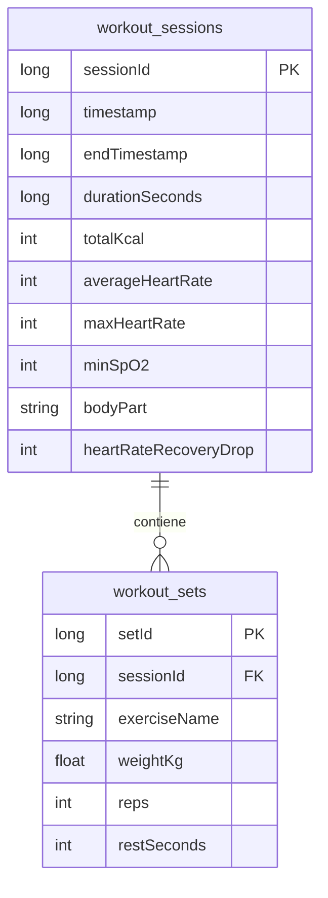

🔱 GymNemo: Estructura y Formato de Datos Guardados (v2.0)
======================================================

Este documento detalla la estructura lógica de los datos de entrenamiento de GymNemo, las tablas de la base de datos local (Room DB), la especificación de los campos de telemetría y un ejemplo práctico del formato del historial generado en una jornada de ejercicio.

---

1. Especificación del Modelo Relacional (Room DB)
-------------------------------------------------

La persistencia local en el reloj y el smartphone se divide en dos entidades relacionales conectadas mediante una Clave Foránea (`sessionId`) con borrado en cascada.



### Tabla 1: Sesiones (`workout_sessions` / `mobile_workout_sessions`)
Almacena los metadatos globales del entrenamiento de un grupo muscular.

| Nombre del Campo | Tipo de Dato | Unidad / Formato | Descripción |
| :--- | :--- | :--- | :--- |
| **`sessionId`** | `Long` | ID Autoincremental | Clave primaria que identifica la sesión. |
| **`timestamp`** | `Long` | Milisegundos Unix | Fecha y hora exacta de inicio del entrenamiento (permite reconstruir fecha, hora, día). |
| **`endTimestamp`** | `Long` | Milisegundos Unix | Fecha y hora exacta de finalización del entrenamiento. |
| **`durationSeconds`** | `Long` | Segundos | Tiempo neto de entrenamiento activo (excluyendo pausas). |
| **`totalKcal`** | `Int` | Kilocalorías (kcal) | Gasto energético total estimado por segundo (Fórmula metabólica de Keytel). |
| **`averageHeartRate`** | `Int` | Latidos por Minuto (BPM) | Frecuencia cardíaca media de la sesión. |
| **`maxHeartRate`** | `Int` | Latidos por Minuto (BPM) | Frecuencia cardíaca máxima registrada durante la sesión (útil para detectar límites). |
| **`minSpO2`** | `Int` | Porcentaje (%) | Porcentaje de oxígeno en sangre más bajo medido en la sesión (detector de hipoxia). |
| **`bodyPart`** | `String` | Texto plano | Categoría muscular entrenada: `"brazo"`, `"pierna"` o `"torso"`. |
| **`heartRateRecoveryDrop`** | `Int` | BPM | Caída de pulsaciones lograda en el test de recuperación de 60 segundos al final de la sesión (HRR). |

### Tabla 2: Series (`workout_sets` / `mobile_workout_sets`)
Almacena cada serie individual realizada dentro de una sesión de entrenamiento.

| Nombre del Campo | Tipo de Dato | Unidad / Formato | Descripción |
| :--- | :--- | :--- | :--- |
| **`setId`** | `Long` | ID Autoincremental | Clave primaria de la serie. |
| **`sessionId`** | `Long` | Clave Foránea | Enlaza la serie con su sesión madre (`sessionId`). |
| **`exerciseName`** | `String` | Texto plano | Nombre del ejercicio (ej. `"Curl Bíceps Mancuerna"`). |
| **`weightKg`** | `Float` | Kilogramos (kg) | Peso utilizado en la serie (permite decimales, ej. `22.5`). |
| **`reps`** | `Int` | Unidades | Repeticiones completadas en la serie. |
| **`restSeconds`** | `Int` | Segundos | Descanso sugerido o transcurrido antes de la serie. |

---

2. Ejemplo Práctico de un Día de Entrenamiento
----------------------------------------------

Para entender cómo se guardan estos datos, supongamos que hoy entrenas **Brazo** realizando **2 ejercicios** (Curl Martillo y Extensión de Tríceps Polea).

### Representación Relacional (Cómo se ve en BD)

#### Registro en `workout_sessions`
```text
sessionId: 104
timestamp: 1784226030000  (Viernes, 17 de Julio de 2026, 09:15 AM - Inicio)
endTimestamp: 1784227570000  (Viernes, 17 de Julio de 2026, 09:40 AM - Fin)
durationSeconds: 1540     (25 minutos y 40 segundos activos)
totalKcal: 245
averageHeartRate: 138
maxHeartRate: 168         (Pico máximo de pulso)
minSpO2: 90               (Oxígeno bajó temporalmente al 90% antes de recuperarse)
bodyPart: "brazo"
heartRateRecoveryDrop: 24 (Tus pulsaciones bajaron 24 BPM en 60s - "Excelente")
```

#### Registros asociados en `workout_sets`
| setId | sessionId | exerciseName | weightKg | reps | restSeconds |
| :--- | :--- | :--- | :---: | :---: | :---: |
| 301 | 104 | Curl Martillo | 20.0 | 12 | 90 |
| 302 | 104 | Curl Martillo | 22.0 | 10 | 90 |
| 303 | 104 | Extensión Tríceps Polea | 30.0 | 15 | 60 |
| 304 | 104 | Extensión Tríceps Polea | 35.0 | 12 | 60 |

---

3. Formatos de Exportación para Google Drive
-------------------------------------------

Para realizar copias de seguridad portátiles en Google Drive, la aplicación del smartphone convertirá los datos de las bases de datos en los siguientes formatos estándares:

### A. Formato JSON (Copia de Seguridad - Restaurable)
Este formato agrupa y anida las series dentro de sus correspondientes sesiones, ideal para reconstruir el historial en otro teléfono.

```json
[
  {
    "timestamp": 1784226030000,
    "endTimestamp": 1784227570000,
    "durationSeconds": 1540,
    "totalKcal": 245,
    "averageHeartRate": 138,
    "maxHeartRate": 168,
    "minSpO2": 90,
    "bodyPart": "brazo",
    "heartRateRecoveryDrop": 24,
    "sets": [
      {
        "exerciseName": "Curl Martillo",
        "weightKg": 20.0,
        "reps": 12,
        "restSeconds": 90
      },
      {
        "exerciseName": "Curl Martillo",
        "weightKg": 22.0,
        "reps": 10,
        "restSeconds": 90
      },
      {
        "exerciseName": "Extensión Tríceps Polea",
        "weightKg": 30.0,
        "reps": 15,
        "restSeconds": 60
      },
      {
        "exerciseName": "Extensión Tríceps Polea",
        "weightKg": 35.0,
        "reps": 12,
        "restSeconds": 60
      }
    ]
  }
]
```

### B. Formato CSV (Excel / Google Sheets)
Este formato plano separa los campos por comas, permitiendo abrir el archivo directamente en un ordenador para hacer análisis, tablas dinámicas y gráficos de rendimiento.

Nombre del archivo: `gymnemo_entrenamientos.csv`
```csv
Fecha,Hora Inicio,Hora Fin,Zona Muscular,Ejercicio,Serie,Peso (KG),Reps,Descanso (s),Calorias,HR Promedio,HR Max,Oxigeno Min,Recuperacion (HRR)
17/07/2026,09:15,09:40,brazo,Curl Martillo,1,20.0,12,90,245,138,168,90%,-24 BPM
17/07/2026,09:15,09:40,brazo,Curl Martillo,2,22.0,10,90,245,138,168,90%,-24 BPM
17/07/2026,09:15,09:40,brazo,Extensión Tríceps Polea,3,30.0,15,60,245,138,168,90%,-24 BPM
17/07/2026,09:15,09:40,brazo,Extensión Tríceps Polea,4,35.0,12,60,245,138,168,90%,-24 BPM
```
