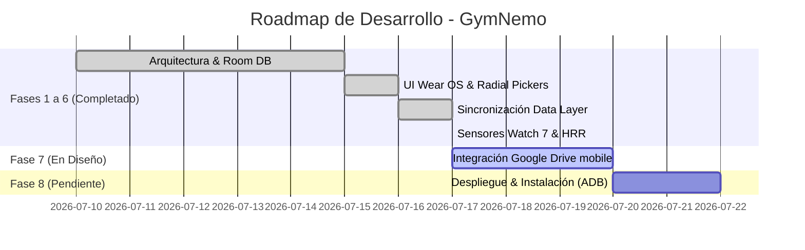

🔱 GymNemo: Roadmap Global de Desarrollo (v2.0)
==============================================

Este documento define el estado de desarrollo del proyecto GymNemo y el Roadmap paso a paso para completar la integración total del ecosistema (Wear OS + Mobile App + Sincronización + Google Drive).

---

1. Cronograma Visual de Desarrollo (Mermaid)
--------------------------------------------

---

2. Detalle de Fases de Desarrollo
---------------------------------

### 📍 Estado Actual: **Fase 6 Completada / Iniciando Fase 7**

#### [✓] FASE 1: Capa de Datos y Almacenamiento Local (Reloj)
*   **Estado:** Completado.
*   **Detalle:** Configuración de la base de datos Room (`GymNemoDatabase`) para almacenar `WorkoutSession` y `WorkoutSet`. DataStore preferencial para los datos físicos del usuario (peso corporal, altura, edad, sexo, objetivos semanales).

#### [✓] FASE 2: Interfaz Wear OS Declarativa y Rediseño de Controles
*   **Estado:** Completado.
*   **Detalle:** Creación de las pantallas radiales divididas en tres (Y-Split) para Portada, Ajustes y Objetivos. Implementación de los selectores numéricos radiales Y-Split para peso, altura, año y objetivos calóricos.

#### [✓] FASE 3: Flujo de Pausa y Toma de Decisiones del Usuario
*   **Estado:** Completado.
*   **Detalle:** Creación de la pantalla de pausa con temporizador positivo central y 3 caminos de acción (Repetir Serie, Nueva Serie Directa, Terminar Ejercicio) conduciendo a un registro secuencial reps/peso limpio. Pantalla de fin de día (`WorkoutCompleteScreen`).

#### [✓] FASE 4: Módulo Móvil `:mobile` Base
*   **Estado:** Completado.
*   **Detalle:** Creación del módulo complementario para smartphone, base de datos espejo local en el teléfono (`WorkoutDb`), e interfaz Compose de estadísticas (total entrenos y kcal) e historial.

#### [✓] FASE 5: Sincronización Inalámbrica Reloj-Móvil
*   **Estado:** Completado.
*   **Detalle:** Integrada la sincronización por Bluetooth mediante Wear OS Data Layer API (`DataLayerListenerService` en el móvil). Al guardar una sesión en el reloj, se transmiten y guardan automáticamente los datos en la base de datos del móvil de forma pasiva y reactiva.

#### [✓] FASE 6: Sensores Avanzados (Samsung Watch 7)
*   **Estado:** Completado.
*   **Detalle:** Añadido el test de recuperación cardíaca de 60 segundos (`HeartRateRecoveryScreen`) al finalizar el ejercicio que calcula el drop (HRR) y lo almacena. Implementada la detección de hipoxia (SpO2 < 92%) en la pantalla de pausa con aviso circular azul celeste expansivo y háptica.

#### [ ] FASE 7: Conexión con Google Drive (Copia de Seguridad en la Nube)
*   **Estado:** Pendiente (Listo para comenzar).
*   **Detalle:**
    1.  Configurar la consola de desarrolladores de Google (Google Cloud Console) y habilitar la API de Google Drive.
    2.  Implementar Google Sign-In en el móvil para solicitar permisos de lectura/escritura en la carpeta de la app (`AppFolder` de Drive).
    3.  Añadir un botón en la aplicación móvil: **"Exportar Historial a Google Drive"** que genere un archivo JSON/CSV y lo suba de forma segura sin servidores intermediarios.

#### [ ] FASE 8: Firma, Empaquetado e Instalación Local
*   **Estado:** Pendiente.
*   **Detalle:** Generar las claves de firma (`keystore`) para compilar los APKs de producción, instalar en los dispositivos físicos mediante depuración inalámbrica ADB (Android Debug Bridge), o subirlos a Google Play Console en el canal de pruebas internas.
